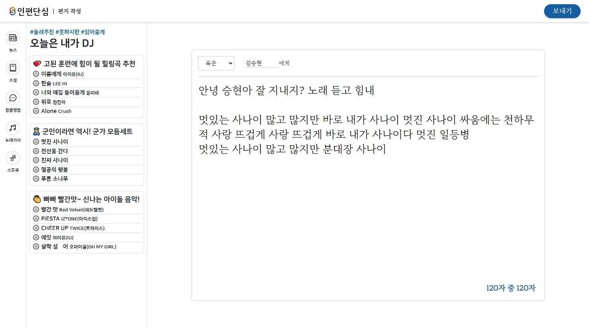

<p align="center"></p>
<p align='center'>
 
 <a href="https://github.com/osamhack2020/WEB_InpenDansim_INPENDANSIM/graphs/contributors"></a>
 <a href='https://github.com/osamhack2020/WEB_InpenDansim_INPENDANSIM/blob/main/LICENSE'></a>
 <a href='https://osamhack2020.github.io/WEB_InpenDansim_INPENDANSIM/'></a>
</p>
<p align='center'>
 <a href='https://www.facebook.com/%EC%9D%B8%ED%8E%B8%EB%8B%A8%EC%8B%AC-%EB%8B%A8%EC%88%9C%ED%95%98%EA%B3%A0-%EC%8B%AC%ED%94%8C%ED%95%98%EA%B2%8C-104789958104175'></a>
</p>
<br>
로고는 '단순함'을 뜻하는 simple의 S와, 육 · 해 · 공 · 해병대를 상징하는 4색이 어우러져 인터넷 편지 서비스로 전군을 하나로 연결시킨다는 의미를 담고 있습니다.
<br><br>

# 📝 프로젝트 설명
<p><b>인편단심</b>은 훈련소에 편지를 보내는 지인들이 보다 쉽고 간편하게 편지를 쓸 수 있도록 기존 인편 서비스들의 복잡한 절차를 개선하고 사용자들이 편지에 담는 내용과 작성 패턴을 기반으로 다양한 컨텐츠와 편의기능을 제공하는 웹 서비스입니다.<br>
 또한 사용자들에게 쉽고 편리한 서비스에서 나아가 전군통합의 민간인을 대상으로 소통할 수 있는 플랫폼을 목표로 하고 있습니다.</p>

<br><br>
# 🎬 팀소개 및 프로젝트 설명 동영상(제작중)

## 팀소개 및 프로젝트 설명 동영상
 </img>

* __[데모 페이지 보기](https://osamhack2020.github.io/WEB_InpenDansim_INPENDANSIM/)__

* __[발표영상 보러가기](https://youtu.be/mg5sbkWaqNY)__
[](https://www.youtube.com/watch?v=mg5sbkWaqNY)

* __[시연영상 보러가기](https://www.youtube.com/watch?v=Li7epsTU2LI)__

[](https://www.youtube.com/watch?v=Li7epsTU2LI)


<br><br>
# 📐 기능 설계
 
 
###  초기 인편단심 컨셉 구상 스케치
 > 여러번의 컨셉 수정 끝에 탄생한 인편단심
 <br/>

 <br/>

 ###  Google Jamboard를 사용하여 원거리 회의로 디자인, 컨셉 등 구상
> 그림으로 그렸던 요소들을 최대한 최종 완성본에 가깝게 디자인 후 프로토타입으로 제작<br/>
<br/>

 <br/>
<br/>
 
### 사용 목업 프레임워크: Figma 사용하여 데스크톱, 모바일 프로토타입 제작
> 그림으로 그렸던 요소들을 최대한 최종 완성본에 가깝게 디자인 후 프로토타입으로 제작
 <br/>
 <br/>

<br/>

 ### 데스크탑 버전
 </img>
 
 
### 모바일 버전
 

 
<br><br>
# 🖥 컴퓨터 구성 / 필수 조건 안내 (Prerequisites)
* ECMAScript 6 지원 브라우저 사용
* 권장: Google Chrome 버젼 77 이상
* __IE환경에서 작동이 안될 수도 있습니다.__
### 사용가능 브라우저
 |  |  |  | 
--- | --- | --- | --- | --- |
 56+ ✔ | 32+ ✔ | 16+ ✔ | 42+ ✔ | 8+ ✔ |
 


<br><br>
# 💡 기술 스택 (Technique Used)
<table><tbody>
 <tr>
  <td>
   <div align="center"><a href="https://git-scm.com/" target="_blank">  </a><br>Git</div>
  </td>
  <td>
   <div align="center"><a href="https://firebase.google.com/" target="_blank">  </a><br>Firebase</div>
  </td>
  
   <td width="60">
   <div align="center"><a href="https://nodejs.org" target="_blank">  </a><br>Node.js</div>
  </td>
  <td width="60">
   <div align="center"><a href="https://expressjs.com" target="_blank">  </a><br>Express</div>
  </td>
  <td>
   <div align="center"><a href="https://www.npmjs.com/" target="_blank">  </a><br>npm</div>
  </td>
 </tr>
 <tr>
  <td width="60">
   <div align="center"><a href="https://developer.mozilla.org/en-US/docs/Web/JavaScript" target="_blank">  </a><br>Javascript</div>
  </td>
  <td width="60">
   <div align="center"><a href="https://www.linux.org/" target="_blank">  </a><br>Linux</div>
  </td>
  <td>
   <div align="center"><a href="https://www.w3.org/html/" target="_blank">  </a><br>Html5</div>
  </td>
  <td>
   <div align="center"><a href="https://sass-lang.com" target="_blank">  </a><br>SCSS</div>
  </td>

 </tr>
     <td>
   <div align="center"><a href="https://babeljs.io/" target="_blank">  </a><br>Babel</div>
  </td>
  <td>
   <div align="center"><a href="https://webpack.js.org" target="_blank">  </a><br>Webpack</div>
  </td>
  
  <td>
   <div align="center"><a href="https://vuejs.org/" target="_blank">  </a><br>Vue.js</div>
  </td>
  <td>
   <div align="center"><a href="http://bootstrapk.com/" target="_blank">  </a><br>Bootstrap</div>
  </td>
 </tbody></table>
 


<br><br>
# ✍ 설치 및 실행 안내 (Installation & Execution Process)
1. 인편단심 원격 저장소를 클론합니다.
```bash
$ git clone https://github.com/osamhack2020/WEB_InpenDansim_INPENDANSIM.git
```
2. 생성된 로컬 저장소로 이동 후 yarn을 설치합니다.
```bash
$ cd WEB_InpenDansim_INPENDANSIM
$ yarn install
```
3. yarn을 실행 후 serve를 입력합니다.
```bash
$ yarn run
yarn run v1.17.3
info Commands available from binary scripts: acorn, ansi-html, atob,
...
question Which command would you like to run?: serve
```
4. 브라우저에 http://localhost:8080/ 를 입력하여 사이트에 접속 할 수 있습니다.


# 👨‍👨‍👦‍👦 팀 정보 (Team Information)
- 김태윤(팀장) (chokokty0816@gmail.com), Github Id: Chokoty
- 이은상(팀원) (dmstkdrmatkd@naver.com), Github Id: jxchlee
- 유정호(팀원) (dbwjdgh03@ajou.ac.kr),   Github Id: WebPr0grammer
- 지우석(팀원) (woosukji@snu.ac.kr),     Github Id: woosukji


# 저작권 및 사용권 정보 (Copyleft / End User License)
 * [MIT](https://github.com/osam2020-WEB/Sample-ProjectName-TeamName/blob/master/license.md)
 

